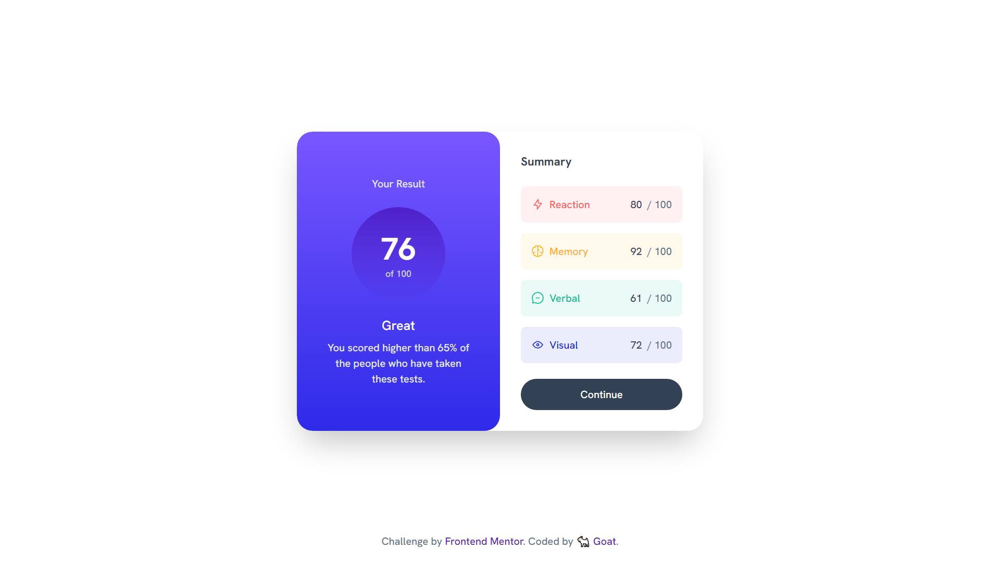

# Frontend Mentor - Results summary component solution

This is a solution to the [Results summary component challenge on Frontend Mentor](https://www.frontendmentor.io/challenges/results-summary-component-CE_K6s0maV). Frontend Mentor challenges help you improve your coding skills by building realistic projects.

## Table of contents

- [Overview](#overview)
  - [The challenge](#the-challenge)
  - [Screenshot](#screenshot)
  - [Links](#links)
- [My process](#my-process)
  - [Built with](#built-with)
  - [What I learned](#what-i-learned)
- [Acknowledgments](#acknowledgments)

## Overview

### The challenge

Users should be able to:

- View the optimal layout for the interface depending on their device's screen size
- See hover and focus states for all interactive elements on the page

### Screenshot

### Links

- Solution URL: [Solution](https://www.frontendmentor.io/solutions/results-summary-using-vite-react-tailwind-css-7Egfwr6lRW)
- Live Site URL: [Vercel](https://fem-results-summary-goat.vercel.app/)

## My process

### Built with

- Semantic HTML5 markup
- CSS custom properties
- Flexbox
- Mobile-first workflow
- [React](https://reactjs.org/) - JS library
- [tailwind CSS](https://tailwindcss.com/) - CSS framework
- [Vite](https://vitejs.dev/) - Build tool

### What I learned

I got to practice Tailwind CSS with React and trying customization.

## Acknowledgments

Thank you to TsbSankara on Youtube for helpful video!
